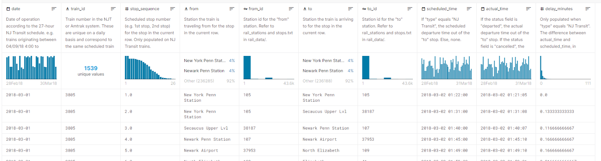
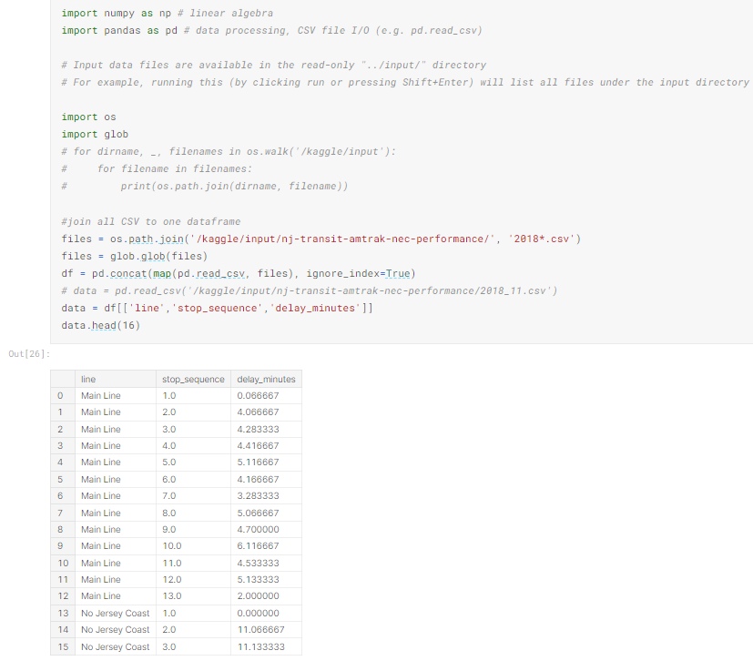
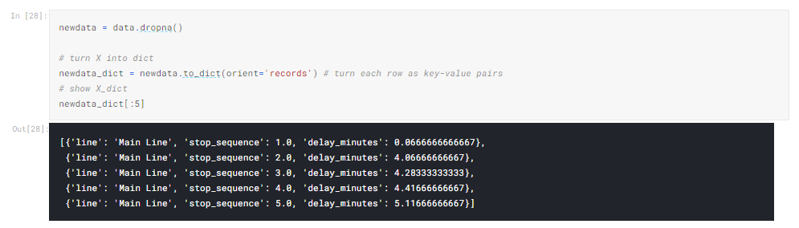
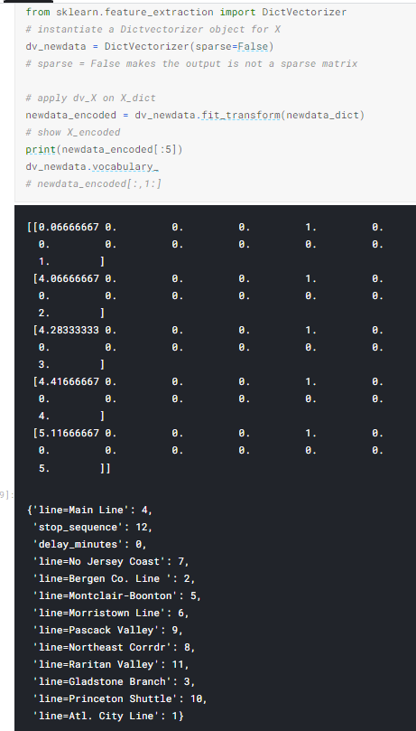
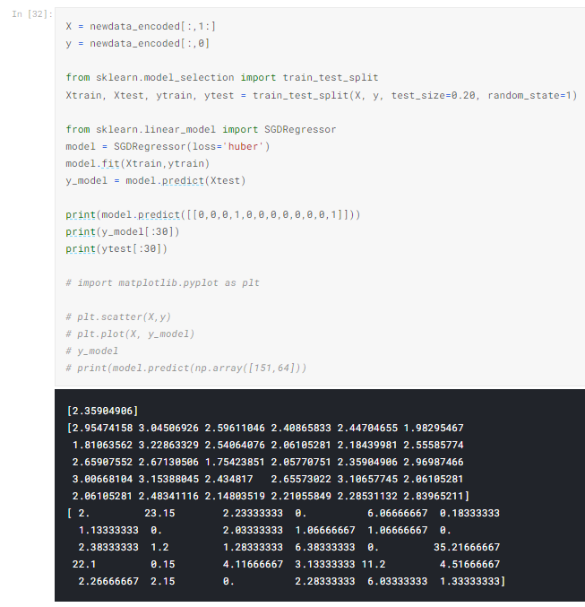
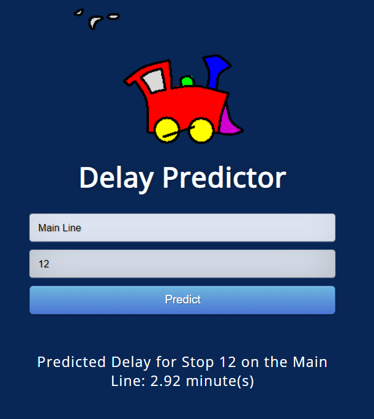
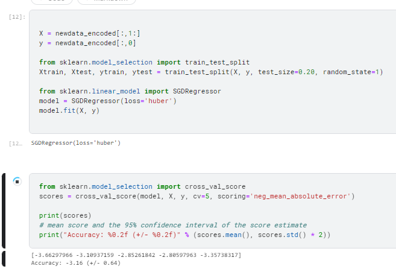

## Introduction

Our Group undertook this project to see if machine learning could be used for an application to predict an expected time delay.
The objective of this project was to find the predicted delay time a person can expect on the NJ Transit trains. There are twelve different Train Lines each holding many different stops. We wanted to explore deploying a web app so that a user can enter their Line and what stop they are getting on the train and it will tell you how long a delay can be expected. We used the NJ Transit + Amtrak (NEC) Rail Performance data set found on Kaggle.

## Selection of Data

The data used can be found [here](https://www.kaggle.com/pranavbadami/nj-transit-amtrak-nec-performance)

### Data Preview

There are a total of 13 columns consisting of date, train_id, stop_sequence, from, from_id, to to_id, scheduled_time, actual_time, delay_minutes, status, line, and type. Of these columns we found that only 3 of these columns were necessary to predict delays, stop_sequence, from, and delay_minutes. The dataset also has data for Amtrak but we are only interested in the NJ Transit data so we dropped the data for Amtrak.

### Data Wrangling

First we dropped all the columns in the data set that we were not going to use.

In the next step we converted our pandas dataframe into a dictionary that we could vectorize.

Next we vectorized the dictionary that we created in the previous step so that we could use it in a machine learning model

## Methods

### Tools

- Numpy
- Pandas
- Scikit
- VS Code
- Flask

### Inference methods used with Scikit

- Linear Regression Model

* SGDRegressor (loss method “huber” which the effect of outliers on the data)

## Results

We found that our model was able to predict the delay time for stop with a variance of +-2.36min(Our best test). To test our model we used the cross validation score with scoring set to use neg_mean_absolute_error. We set cv in the cross val parameters to break our data into 5 different training and testing data sets. After we had our model we used Flask, a python library to convert python code into HTML and css for our deployment.

## Discussion

Our product has an accuracy of +- 2.36 minutes. While this isn’t extremely accurate for precise predictions it does give the user a general idea of how long they should expect to be delayed by. We could improve our product by adding data for the day of the week that each trip took place on as well as correlating it to data regarding the weather for the given day. Adding these features could help us bring down our variance of 2.36 minutes to something far lower and give passengers a more accurate prediction of what to expect for a delay for their trip.

## Summary

The most important finding was that we could use Machine learning to predict a reasonable expected delay time.

## Group Members

Copeland Peacock

Paul Couture

Pete Paravalos

Michael Richards

## Work Cited

“Learn.” Scikit, https://scikit-learn.org/stable/index.html.

“Your Machine Learning and Data Science Community.” Kaggle, https://www.kaggle.com/.
